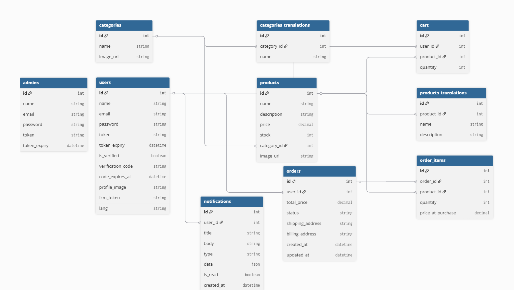

<div align="center">

# 🛒 Tech Nest — Backend API

**Production-style PHP backend for a Flutter e-commerce mobile application.**

<p>
  
  
  
  
</p>

</div>

---

## 📑 Table of Contents

- [🛒 Tech Nest — Backend API](#-tech-nest--backend-api)
- [📖 What is Tech Nest?](#-what-is-tech-nest)
- [✨ Features at a Glance](#-features-at-a-glance)
- [🛠️ Tech Stack](#️-tech-stack)
- [🏗️ Architecture Overview](#️-architecture-overview)
- [🗄️ Database Schema](#️-database-schema)
- [🔐 Authentication Flow](#-authentication-flow)
- [📡 API Endpoints](#-api-endpoints)
- [📬 Request & Response Conventions](#-request--response-conventions)
- [📱 Flutter Integration Notes](#-flutter-integration-notes)
- [🚀 Local Setup](#-local-setup)
- [⚙️ Configuration](#️-configuration)
- [🔒 Security Notes](#-security-notes)
- [🔬 Advanced Behaviors](#-advanced-behaviors)
- [🗺️ Future Improvements](#️-future-improvements)
- [📄 License](#-license)

---

## What is Tech Nest?

Tech Nest is a full-featured REST API backend built in PHP, designed to power a Flutter mobile shopping app. It handles everything from user authentication and product browsing, to cart management, order processing, and real-time push notifications — all in Arabic and English.

The API is split into two surfaces:

- **`/api/user`** — Customer-facing endpoints
- **`/api/admin`** — Admin management endpoints

---

## ✨ Features at a Glance

| Feature | Details |
|---|---|
| 🔐 **Auth** | Registration, email verification, login, logout, password reset |
| 🌍 **Localization** | Full Arabic / English support for responses and push notifications |
| 📦 **Products & Categories** | Filtering, search, pagination, localized names |
| 🛒 **Cart** | Live stock checks, quantity sync, auto-adjustment |
| 📋 **Orders** | Transactional order creation, cancellation with stock restore |
| 🔔 **Push Notifications** | Firebase FCM + MySQL persistence + deep-link payloads |
| 🖼️ **Image Handling** | Upload validation, SHA-256 deduplication, WebP conversion |
| 👮 **Admin Panel** | Full CRUD for products, categories, and order status management |

---

## 🛠️ Tech Stack

- **Runtime** — PHP 8.2 (procedural, file-based architecture)
- **Database** — MySQL via PDO with prepared statements
- **Email** — PHPMailer over SMTP
- **Push Notifications** — Firebase Cloud Messaging HTTP v1
- **Image Processing** — PHP GD (resize + WebP conversion)
- **Server** — Apache with `.htaccess` auth header passthrough
- **Containerization** — Docker (`php:8.2-apache`)

---

## 🏗️ Architecture Overview

Tech Nest is a **file-based, procedural, layered backend** — not a framework project. Each endpoint is a dedicated PHP file. Shared concerns are extracted into helper files.

```
┌─────────────────────────────────────────────┐
│              Mobile App (Flutter)            │
└────────────────────┬────────────────────────┘
                     │ HTTP
┌────────────────────▼────────────────────────┐
│             API Layer (Apache)               │
│   api/user/...          api/admin/...        │
└────────────────────┬────────────────────────┘
                     │
┌────────────────────▼────────────────────────┐
│          Shared Helpers Layer                │
│  functions.php   FCMService.php   lang.php   │
└────────────────────┬────────────────────────┘
                     │
┌────────────────────▼────────────────────────┐
│           Infrastructure Layer               │
│        config/database.php (PDO)             │
└────────────────────┬────────────────────────┘
                     │
        ┌────────────┴────────────┐
        ▼                         ▼
   MySQL Database             uploads/
   (Business Data)            (WebP Images)
```

**Key design decisions:**
- Endpoint-oriented routing by folder and filename — no centralized router
- Thin controllers with inline SQL rather than separate service/repository classes
- Stateless auth via DB-backed bearer tokens with expiry timestamps
- Push notification failures are silently absorbed — core business logic is never blocked by FCM

---

## 🗄️ Database Schema

> See the interactive ERD diagram in the project documentation.

### Tables Summary

| Table | Purpose |
|---|---|
| `users` | Customer accounts, session tokens, FCM tokens, language preference |
| `admins` | Admin credentials and session tokens |
| `categories` | Product grouping metadata |
| `categories_translations` | Localized (Arabic) category names |
| `products` | Core product catalog with price, stock, and category |
| `products_translations` | Localized product name and description |
| `cart` | Per-user temporary shopping cart |
| `orders` | Order headers with status and address data |
| `order_items` | Snapshot of items and price at checkout time |
| `notifications` | In-app notification history (independent of FCM delivery) |

### Relationships

```
users ──< cart
users ──< orders ──< order_items >── products
users ──< notifications
categories ──< products
categories ──< categories_translations
products ──< products_translations
```

### Database ERD Diagram
<p align="center">
  
</p>

---

## 🔐 Authentication Flow

### User Auth

Protected user endpoints require a custom header:
```
token: <user-token>
```

```
Register → Email Verification Code (6-digit, 5 min TTL)
        → Verify Email → Token issued (7-day TTL)
        → Token sent on every protected request
        → Logout clears token from DB
```

Token validation checks: token exists → matches a user row → not expired → account is verified.

### Admin Auth

Protected admin endpoints require:
```
Token: Bearer <admin-token>
```

Admin tokens have a 2-day TTL and are separated entirely from user tokens.

---

## 📡 API Endpoints

### Public User Auth

| Endpoint | Method | Description |
|---|---|---|
| `api/user/auth/register.php` | `POST` | Register with profile image upload |
| `api/user/auth/verify_email.php` | `POST` | Verify email using 6-digit code |
| `api/user/auth/login.php` | `POST` | Login and receive token |
| `api/user/auth/forget_password.php` | `POST` | Send password reset code |
| `api/user/auth/reset_password.php` | `POST` | Reset password with verification code |

### Protected User Endpoints

| Endpoint | Method | Description |
|---|---|---|
| `api/user/auth/logout.php` | `POST` | Invalidate session |
| `api/user/categories/list.php` | `GET` | Localized category list |
| `api/user/products/list.php` | `GET` | Filtered, paginated product listing |
| `api/user/products/get_product.php` | `GET` | Single product with category info |
| `api/user/products/searching_suggestions.php` | `GET` | Up to 10 autocomplete suggestions |
| `api/user/cart/list.php` | `GET` | Cart items and totals |
| `api/user/cart/add.php` | `POST` | Add or overwrite a cart item |
| `api/user/cart/update_quantity.php` | `POST` | Stock-aware quantity update |
| `api/user/cart/remove.php` | `POST` | Remove a cart item |
| `api/user/cart/count.php` | `GET` | Number of unique cart lines |
| `api/user/orders/create.php` | `POST` | Place order from cart (transactional) |
| `api/user/orders/list.php` | `GET` | Current user's orders |
| `api/user/orders/details.php` | `GET` | Single order with items |
| `api/user/orders/cancel.php` | `GET` | Cancel pending order + restore stock |
| `api/user/notifications/save_fcm_token.php` | `POST` | Register device push token |
| `api/user/notifications/get_notifications.php` | `GET` | Paginated notification history |
| `api/user/notifications/mark_notification_read.php` | `POST` | Mark one or all as read |

### Admin Endpoints

| Endpoint | Method | Description |
|---|---|---|
| `api/admin/auth/login.php` | `POST` | Admin login |
| `api/admin/auth/logout.php` | `POST` | Admin logout |
| `api/admin/auth/validate_token.php` | `GET` | Validate admin token |
| `api/admin/categories/list.php` | `GET` | List all categories |
| `api/admin/categories/add.php` | `POST` | Create category (with optional Arabic name + image) |
| `api/admin/categories/update.php` | `POST` | Update category |
| `api/admin/categories/delete.php` | `POST` | Delete category |
| `api/admin/products/list.php` | `GET` | Paginated product list |
| `api/admin/products/add.php` | `POST` | Create product (with optional translations + image) |
| `api/admin/products/update.php` | `POST` | Update product |
| `api/admin/products/delete.php` | `POST` | Delete product |
| `api/admin/orders/update_status.php` | `POST` | Update order status |

---

## 📬 Request & Response Conventions

### Response Envelope

All endpoints return a consistent JSON structure:

```json
{
  "status": 200,
  "message": "Operation successful",
  "data": {}
}
```

### Common Status Codes

| Code | Meaning |
|---|---|
| `200` | Success (fetch, update, logout) |
| `201` | Resource created |
| `400` | Validation failure or bad input |
| `401` | Invalid or expired token / wrong credentials |
| `403` | Forbidden state (e.g. unverified email) |
| `404` | Record not found |
| `409` | Conflict (duplicate email, duplicate category) |
| `500` | Server error (DB, mail, image, JSON) |

### Auth Headers

```http
# User endpoints
token: <user-token>

# Admin endpoints
Token: Bearer <admin-token>

# Localization
lang: ar
Accept-Language: ar
```

---

## 📱 Flutter Integration Notes

### Request Patterns

| Use case | Content type |
|---|---|
| Login, cart, orders, password reset | `application/json` |
| Profile image, product/category image uploads | `multipart/form-data` |
| Listings, filters, single-item fetch | Query string parameters |

### Localization

The backend reads `lang` or `Accept-Language`. If the value starts with `ar`, Arabic content is returned from translation tables. FCM notifications are also localized per the user's stored `lang` preference.

### Push Notification Payload

```json
{
  "type": "order_update",
  "entity": {
    "type": "order",
    "id": "41"
  },
  "extra": {
    "status": "shipped"
  }
}
```

The payload is deep-link friendly — the Flutter app can navigate directly to the relevant screen.

---

## 🚀 Local Setup

### Laragon / XAMPP

1. Place the project in your web root (e.g. `C:\laragon\www\tech-nest-backend`)
2. Start Apache and MySQL
3. Create a MySQL database named `ecommerce_db`
4. Import your SQL schema
5. Ensure `uploads/` is writable by PHP
6. Visit `http://localhost/tech-nest-backend/`


> You still need a reachable MySQL instance and valid Firebase / SMTP credentials.

---

## ⚙️ Configuration

This project does **not** use a `.env` file. All config is hardcoded and must be edited directly.

### Database — `config/database.php`

```php
$db_host = 'localhost';
$db_name = 'ecommerce_db';
$db_user = 'root';
$db_pass = '';
```

### SMTP Email — `helpers/functions.php`

Edit the SMTP host, username, password, port, and from address inside both:
- `sendVerificationEmail()`
- `sendForgotPasswordEmail()`

### Firebase Cloud Messaging

Place your service account JSON at:

```
config/firebase_credentials.json
```

Required fields: `project_id`, `client_email`, `private_key`.

---

## 🔒 Security Notes

### What's protected

- Passwords hashed with `PASSWORD_BCRYPT`
- All protected endpoints require token validation with expiry enforcement
- Admin and user token namespaces are fully separated
- Image uploads are type-checked and converted to WebP
- All SQL uses prepared PDO statements

### Known risks to address before production

- Database and SMTP credentials are hardcoded — move to environment variables
- Firebase credentials are stored in the repository — exclude from version control
- CORS is fully open (`Access-Control-Allow-Origin: *`) — restrict to known origins
- No rate limiting on auth endpoints (login, verify, reset)
- No refresh token strategy or token revocation list

---

## 🔬 Advanced Behaviors

- **Image deduplication** — SHA-256 hash checked before saving any uploaded image
- **Transactional order placement** — stock deduction and order creation happen atomically
- **Transactional order cancellation** — stock is restored atomically on cancel
- **Localized push notifications** — FCM payload is generated in the user's stored language
- **Multi-target FCM delivery** — supports targeting all users, one user, or a list of users
- **Notification persistence** — notifications are saved to MySQL regardless of FCM delivery outcome

---

## 🗺️ Future Improvements

- Move all credentials to environment variables (`.env` + `vlucas/phpdotenv` or similar)
- Replace file-based routing with a lightweight router or framework
- Introduce service and repository classes
- Add database migrations and seeders
- Add refresh tokens and session/device management
- Implement rate limiting and brute-force protection on auth endpoints
- Move email and FCM delivery to queued background jobs
- Add structured logging and audit trails
- Add automated tests for auth, cart, and order flows
- Standardize all endpoints to `Authorization: Bearer` header pattern

---

## 📄 License

This project is licensed under the **MIT License** — see the [LICENSE](LICENSE) file for details.